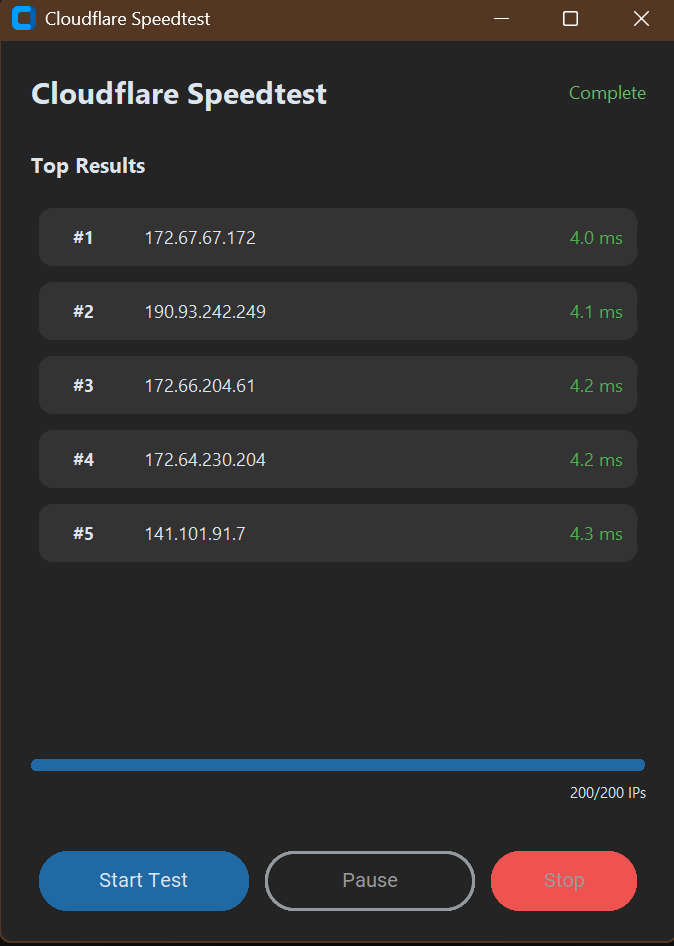
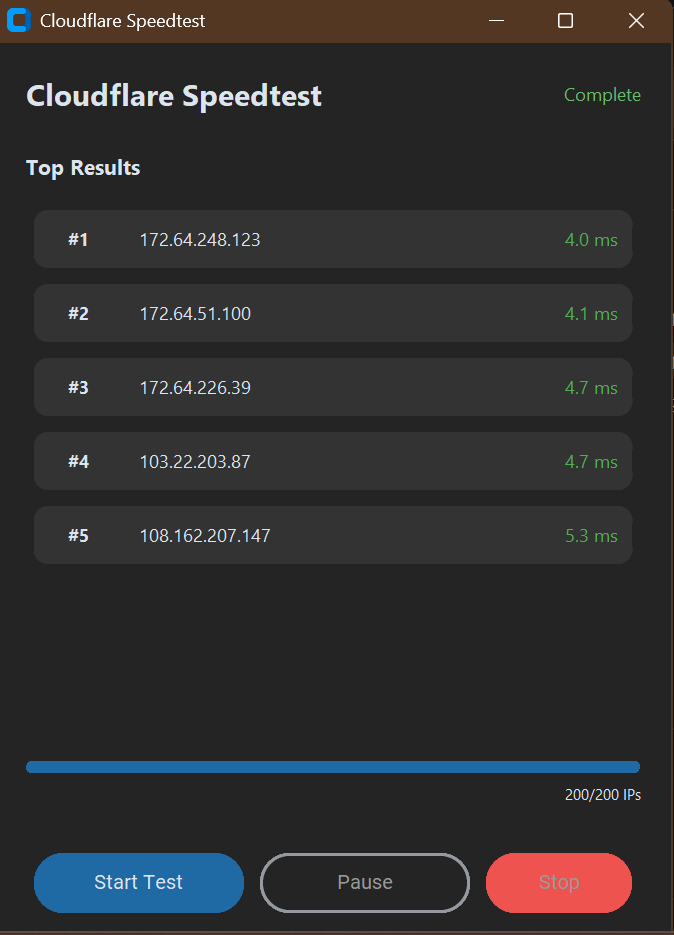

# CF-IP-Speedtest (Material Edition)

A lightweight Windows 11 utility to find the fastest Cloudflare IPs using random sampling and concurrent TCP testing.

| Speed Test Result 1 | Speed Test Result 2 |
|:---:|:---:|
|  |  |

## Tech Stack
- **Language**: Python 3.10+
- **UI Framework**: CustomTkinter (Material Design 3 / Material You)
- **Networking**: Native `socket` library (TCP Connect to port 443)
- **Concurrency**: `concurrent.futures.ThreadPoolExecutor`
- **Packaging**: PyInstaller

## Mechanism
1.  **Input Parsing**: Reads CIDR blocks (e.g., `104.16.0.0/12`) from `ip.txt`.
2.  **Random Sampling**: Instead of scanning millions of IPs, it intelligently samples a subset (default ~200) from the provided ranges to ensure speed.
3.  **Latency Testing**: Specific TCP handshake (SYN/ACK) timing on port 443 is used to measure latency, which is more reliable than ICMP for this purpose.
4.  **Real-time Sorting**: Uses a min-priority logic to maintain and display the Top 5 lowest latency IPs dynamically.

## Usage
1.  Ensure `ip.txt` containing Cloudflare CIDR ranges is present in the root directory.
2.  Run the executable or script.
3.  Click **Start Test**.
4.  The application will display the fastest IPs found in real-time.

## License
This project is licensed under the MIT License - see the [LICENSE](LICENSE) file for details.
